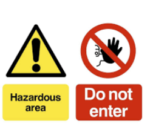
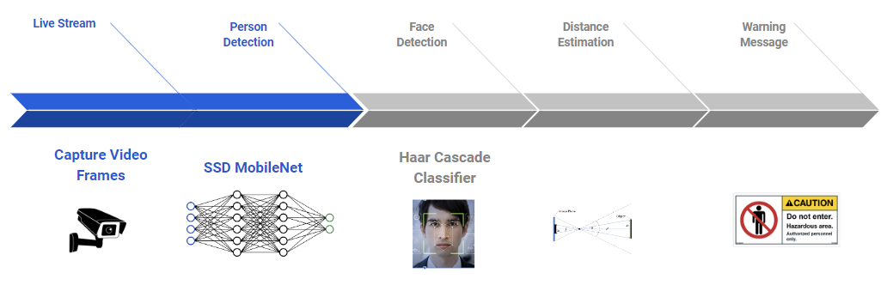
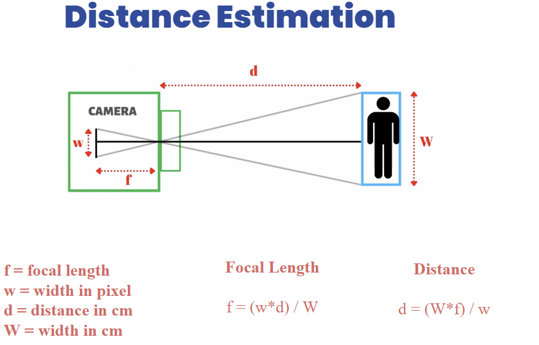
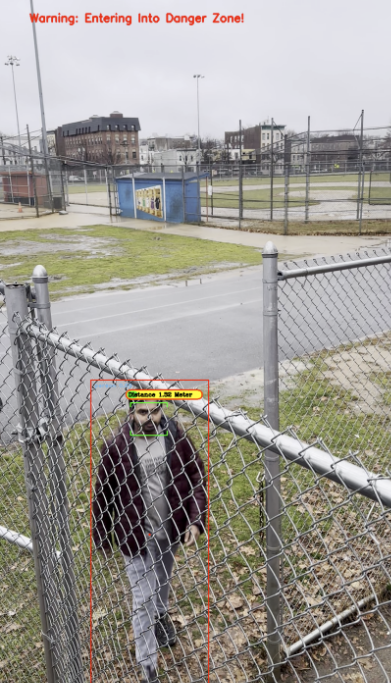

# Safe Zone: Real-Time Hazardous Area Monitoring System

<div style="text-align:center">
    
</div>

In an era where safety and security are paramount, especially in environments fraught with inherent risks, the advent of technologies like computer vision has opened new avenues for enhancing safety measures. The "Safe Zone: Real-Time Hazardous Area Monitoring System" stands at the forefront of this technological revolution. This system, utilizing the sophisticated capabilities of computer vision, is designed to identify and respond to unauthorized or unsafe human entry into hazardous areas, thereby mitigating risks and ensuring safety.

Hazardous areas pose significant dangers to human life and health. These environments, often found in industrial, chemical, and nuclear facilities, are characterized by the presence of harmful substances, extreme conditions, and potential for catastrophic events. The risks in these areas include exposure to toxic chemicals, risk of explosions, extreme temperatures, and radiation, among others. Human entry into these zones, whether accidental or deliberate, can lead to severe injuries, fatalities, and environmental disasters

### Installation

 requires [python](https://www.python.org/download/releases/3.0/) v3(3.7.9) to run.


Installing required packages
```sh
$ pip install -r requirement.txt
```

### Run Application

```sh
$ python objectdetector.py
```
### Design 



### Distance Estimation  


### Result 


